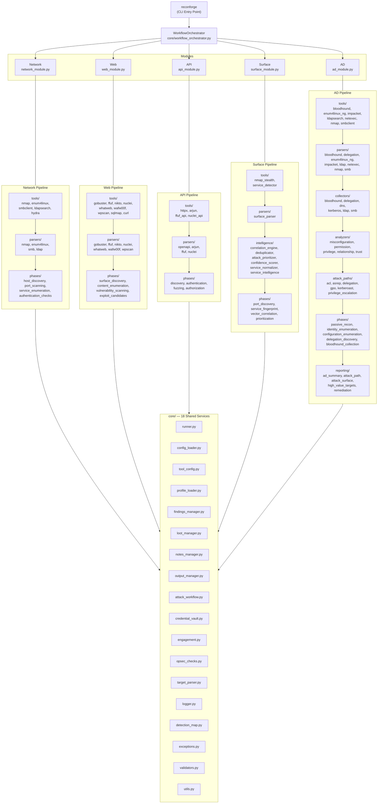

# ReconForge Architecture

> Version 1.1.0 — Last updated: 2026-04-13

## System Overview

ReconForge is a modular penetration testing reconnaissance framework built in Python. It automates the reconnaissance phase of engagements through five specialized modules and a cross-module workflow orchestrator, all sharing a common core services layer.

## Validated Architecture

All five modules follow the same layered pipeline:

```
tools/ → parsers/ → phases/ → module.py → core/
```

Two modules extend this base pattern:

- **Surface** adds an `intelligence/` layer between parsers and phases
- **AD** extends to: `tools/ → parsers/ → collectors/ → analyzers/ → attack_paths/ → phases/ → reporting/ → module.py → core/`

### Architecture Overview Diagram



## Directory Structure

```
reconforge/
├── reconforge/                     # installable CLI package
│   ├── cli.py                      # argparse dispatcher (entry point: `reconforge` / `python -m reconforge`)
│   └── __main__.py
├── config/
│   ├── tools.yaml                 # Tool binary paths, timeouts, scan profiles
│   └── profiles.yaml              # OPSEC-aware scan profiles
├── core/                          # Shared services layer
│   ├── runner.py                  # Secure subprocess execution (list[str], no shell=True)
│   ├── config_loader.py           # YAML config loading with caching
│   ├── tool_config.py             # Typed accessor for tool YAML entries
│   ├── profile_loader.py          # OPSEC profile resolution
│   ├── findings_manager.py        # 5-level confidence model, severity clamping
│   ├── loot_manager.py            # Credential/hash/token tracking, optional Fernet encryption
│   ├── notes_manager.py           # Timestamped session notes
│   ├── output_manager.py          # Structured output directories, engagement reports
│   ├── attack_workflow.py         # Kill-chain tracking, hypothesis management
│   ├── credential_vault.py        # Centralized credential store with deduplication
│   ├── engagement.py              # Engagement lifecycle (planning → active → completed)
│   ├── workflow_orchestrator.py   # Cross-module chaining with conditional branching
│   ├── validators.py              # IP, CIDR, hostname, URL, port validation
│   ├── opsec_checks.py            # Technique-level OPSEC gating
│   ├── detection_map.py           # Noise-level mapping for all techniques
│   ├── exceptions.py              # Structured exception hierarchy
│   ├── logger.py                  # Color-coded logging with credential sanitization
│   ├── target_parser.py           # Target string parsing (IP, CIDR, hostname)
│   └── utils.py                   # Utility helpers
├── modules/
│   ├── network/                   # Network reconnaissance
│   │   ├── base.py                # NetworkPhaseBase (ABC)
│   │   ├── network_module.py      # Module orchestrator
│   │   ├── tools/                 # nmap, enum4linux, smbclient, ldapsearch, hydra
│   │   ├── parsers/               # nmap_parser, enum4linux_parser, smb_parser, ldap_parser
│   │   └── phases/                # host_discovery, port_scanning, service_enumeration, authentication_checks
│   ├── web/                       # Web application reconnaissance
│   │   ├── base.py                # WebPhaseBase (ABC)
│   │   ├── web_module.py          # Module orchestrator
│   │   ├── tools/                 # gobuster, ffuf, nikto, nuclei, whatweb, wafw00f, wpscan, sqlmap, curl_tool
│   │   ├── parsers/               # gobuster, ffuf, nikto, nuclei, whatweb, wafw00f, wpscan
│   │   └── phases/                # surface_discovery, content_enumeration, vulnerability_scanning, exploit_candidates
│   ├── api/                       # API security assessment
│   │   ├── base.py                # APIPhaseBase (ABC)
│   │   ├── api_module.py          # Module orchestrator
│   │   ├── tools/                 # ffuf_api, httpx_tool, arjun_tool, nuclei_api
│   │   ├── parsers/               # openapi_parser, arjun_parser, ffuf_parser, nuclei_parser
│   │   └── phases/                # discovery, authentication, fuzzing, authorization
│   ├── surface/                   # Attack surface mapping
│   │   ├── base.py                # SurfacePhaseBase (ABC)
│   │   ├── surface_module.py      # Module orchestrator
│   │   ├── tools/                 # nmap_stealth, service_detector
│   │   ├── parsers/               # surface_parser
│   │   ├── intelligence/          # correlation_engine, confidence_scorer, deduplicator, service_normalizer, service_intelligence, attack_prioritizer
│   │   └── phases/                # port_discovery, service_fingerprint, vector_correlation, prioritization
│   └── ad/                        # Active Directory reconnaissance
│       ├── base.py                # ADPhaseBase (ABC)
│       ├── ad_module.py           # Module orchestrator
│       ├── tools/                 # nmap, enum4linux_ng, impacket, advanced_impacket, ldapsearch, smbclient, bloodhound, netexec
│       ├── parsers/               # nmap, enum4linux_ng, impacket, smb, ldap, bloodhound, delegation, netexec
│       ├── collectors/            # bloodhound, delegation, dns, kerberos, ldap, smb
│       ├── analyzers/             # misconfiguration, permission, privilege, relationship, trust
│       ├── attack_paths/          # acl, asrep, delegation, gpo, kerberoast, privilege_escalation
│       ├── phases/                # passive_recon, identity_enumeration, configuration_enumeration, delegation_discovery, bloodhound_collection
│       └── reporting/             # ad_summary, attack_path, attack_surface, high_value_targets, remediation, report_builders
└── tests/                         # 375 tests (pytest)
```

## Core Services

### Runner (`core/runner.py`)

Secure subprocess execution. **All commands are executed as `list[str]` via `subprocess.run` — never `shell=True`.**

- String commands are accepted for backward compatibility but emit a `DeprecationWarning` and are split via `shlex.split`
- `validate_arg()` rejects shell metacharacters (`; & | \` $ ( ) { }`) before they reach subprocess
- Returns `RunResult` dataclass with stdout, stderr, returncode, duration
- `run_or_raise()` variant throws typed exceptions: `ToolNotFoundError`, `TimeoutError`, `ExecutionError`
- Supports dry-run mode, custom timeouts, stdin piping, environment overrides
- Maintains a command log exportable via `get_command_log()` / `save_command_log()`

### ConfigLoader (`core/config_loader.py`)

Single authoritative source for all YAML configuration. Loads `tools.yaml` and `profiles.yaml` with file-level caching. No fallback namespaces — the config file is the source of truth.

### ToolConfig (`core/tool_config.py`)

Typed accessor for a tool's YAML configuration. Provides:

- `binary`, `alt_binary`, `required`, `default_timeout`, `description`, `detection`, `opt_in_only`
- `mode_timeout(mode, default)` — timeout resolution: mode-specific → tool default → caller default
- `mode_args(mode)`, `mode_detection(mode)`, `mode_value(mode, key)`
- `safety(key)` — for safety blocks (e.g., hydra max_tasks)
- `collection(method, key)` — for collection methods (e.g., bloodhound)
- `effective_timeout(mode, caller_default)` — unified timeout resolution
- Full backward compatibility: `ToolConfig(None, "tool")` returns caller defaults

### ProfileLoader (`core/profile_loader.py`)

Resolves OPSEC profiles with module-specific overrides:

1. Module-specific variant (`stealth_ad`, `normal_web`, etc.)
2. Exact profile name
3. Base mode via canonical mapping
4. Empty dict (all defaults)

Provides: `timing`, `allowed_noise`, `nmap_timing`, `scan_delay`, `is_technique_enabled()`, `enabled_phases()`.

### FindingsManager (`core/findings_manager.py`)

5-level confidence model with strict severity clamping. See [FINDINGS.md](FINDINGS.md) for details.

### LootManager (`core/loot_manager.py`)

Tracks credentials, hashes, tokens, shares, users, and services. Supports:

- Automatic deduplication
- Optional Fernet encryption (`--encrypt-loot`), key stored at `~/.reconforge/loot.key`
- Typed add methods: `add_credential()`, `add_hash()`, `add_user()`, `add_share()`, `add_service()`

### CredentialVault (`core/credential_vault.py`)

Centralized credential store shared across modules. Supports:

- Types: `password`, `hash_ntlm`, `hash_ntlmv2`, `hash_other`, `token_jwt`, `token_bearer`, `api_key`, `ssh_key`, `username`, `cookie`, `certificate`
- Automatic deduplication via fingerprinting
- `ingest_from_loot(loot_manager)` — auto-import from LootManager
- `contribute_to_loot(loot_manager)` — push back to LootManager
- `get_for_service(service)` — service-specific credential retrieval
- Optional Fernet encryption, export/import (JSON, username lists, password lists, hash files)

### EngagementManager (`core/engagement.py`)

Full lifecycle tracking: `planning → active → paused → completed → cancelled`

- Pause/resume via JSON serialization (`save()` / `load()`)
- Timeline recording, module result aggregation
- Findings and loot summary aggregation across modules

### WorkflowOrchestrator (`core/workflow_orchestrator.py`)

Cross-module chaining with:

- `WorkflowContext` — shared data bus (live hosts, open ports, services, domains, URLs)
- Conditional branching: AD runs if LDAP/Kerberos/SMB detected; Web/API if HTTP detected
- Automatic credential vault integration — credentials flow between modules
- `full_recon()` — pre-configured pipeline: surface → network → ad → web → api
- `targeted()` — run specific modules without conditions

### AttackWorkflow (`core/attack_workflow.py`)

Kill-chain tracking with:

- Workflow steps with hypotheses, justifications, alternatives
- Attack path recording (name, description, steps, risk, prerequisites)
- Next-command suggestions (prioritized)
- Rabbit-hole tracking

### NotesManager (`core/notes_manager.py`)

Timestamped session notes with categories: `phase`, `finding`, `command`, `general`. Markdown export with timeline icons.

### OutputManager (`core/output_manager.py`)

Consistent directory structure:

```
outputs/<target>/<module>/
├── raw/                  # Raw tool output
├── parsed/               # Parsed results
├── findings.json         # JSON findings
├── findings.md           # Markdown findings
├── loot.json             # Discovered loot
├── session.md            # Session notes
├── commands.log          # Command log
├── attack_paths.md       # Attack path documentation
└── quick_report.md       # Quick summary report
```

### Validators (`core/validators.py`)

Input validation: `validate_ip()`, `validate_cidr()`, `validate_hostname()`, `validate_target()`, `validate_port()`, `validate_port_range()`, `validate_url()`, `validate_domain()`. All raise typed `ValidationError` subclasses.

### Exception Hierarchy (`core/exceptions.py`)

```
ReconForgeError
├── ConfigError
│   └── ProfileNotFoundError
├── ValidationError
│   ├── TargetValidationError
│   └── PortValidationError
├── ExecutionError
│   ├── ToolNotFoundError
│   └── TimeoutError
├── ModuleError
│   └── PhaseError
├── WorkflowError
│   └── WorkflowAbortedError
├── CredentialVaultError
└── EngagementError
    └── EngagementNotFoundError
```

### Logger (`core/logger.py`)

Color-coded console output with file logging. Features:

- Credential sanitization in all log output (passwords, hashes, tokens, API keys redacted)
- Context logging via `with_context()` for module/phase prefixes
- Structured methods: `command()`, `finding()`, `loot()`, `credential()`, `phase_start()`, `phase_end()`

### OPSEC System (`core/opsec_checks.py`, `core/detection_map.py`)

Every tool/technique has a noise level (`low`, `medium`, `high`, `very_high`). The `OpsecChecker` gates execution based on the active profile's `allowed_noise_levels`. Blocked techniques log a warning with the reason.

## Data Flow

```
CLI (reconforge)
    │
    ▼
Module Orchestrator (e.g., NetworkModule)
    │
    ├── ConfigLoader → tools.yaml, profiles.yaml
    ├── ProfileLoader → OPSEC profile resolution
    ├── OpsecChecker → technique gating
    │
    ▼
Phase (e.g., HostDiscoveryPhase)
    │
    ├── Tool Wrapper → builds list[str] command
    │       │
    │       ▼
    │   Runner.run() → subprocess.run(cmd_list) → raw output
    │
    ├── Parser → structured data from raw output
    │
    ├── FindingsManager.add() → severity-clamped findings
    ├── LootManager.add() → deduplicated loot
    ├── NotesManager.add() → timestamped notes
    └── AttackWorkflow.add_step() → kill-chain tracking
    │
    ▼
OutputManager → structured output files
```

## Phase Base Classes

All modules use a consistent phase base class with an identical constructor signature (11 parameters):

| Parameter | Type | Description |
|-----------|------|-------------|
| `logger` | `ReconLogger` | Logging instance |
| `runner` | `Runner` | Subprocess executor |
| `config` | `ConfigLoader` | YAML config access |
| `output_dir` | `Path` | Parsed output directory |
| `findings` | `FindingsManager` | Finding tracker |
| `loot` | `LootManager` | Loot tracker |
| `workflow` | `AttackWorkflow` | Kill-chain tracker |
| `notes` | `NotesManager` | Session notes |
| `opsec` | `OpsecChecker` | OPSEC gating |
| `opsec_mode` | `str` | Current mode string |
| `profile` | `ProfileLoader` | Resolved OPSEC profile |

Each phase base defines class attributes: `PHASE_NUMBER`, `PHASE_NAME`, `PHASE_DESCRIPTION` and requires subclasses to implement a `run()` method.

## Command Execution Safety

- **Zero instances** of `shell=True` in production code
- All tool wrappers build commands as `list[str]`
- `Runner.run()` accepts both `str` and `list[str]`, splitting strings via `shlex.split`
- `validate_arg()` rejects shell metacharacters before they reach `subprocess`
- Logger sanitizes credentials from all log output

## Testing

- **375 tests, all passing** (pytest, ~3.1s)
- Coverage spans: config_loader, credential_vault, engagement, logger, loot_manager, profile_loader, runner, target_parser, validators, workflow_orchestrator, tool_config, API module, parsers (nmap, arjun, ffuf, nuclei_api), JWT analysis, OpenAPI parser, authorization/fuzzing, surface intelligence, profile activation

---

*Architecture validated: 2026-03-21 — ReconForge v1.1.0 Stabilization Audit (375/375 tests passing)*
