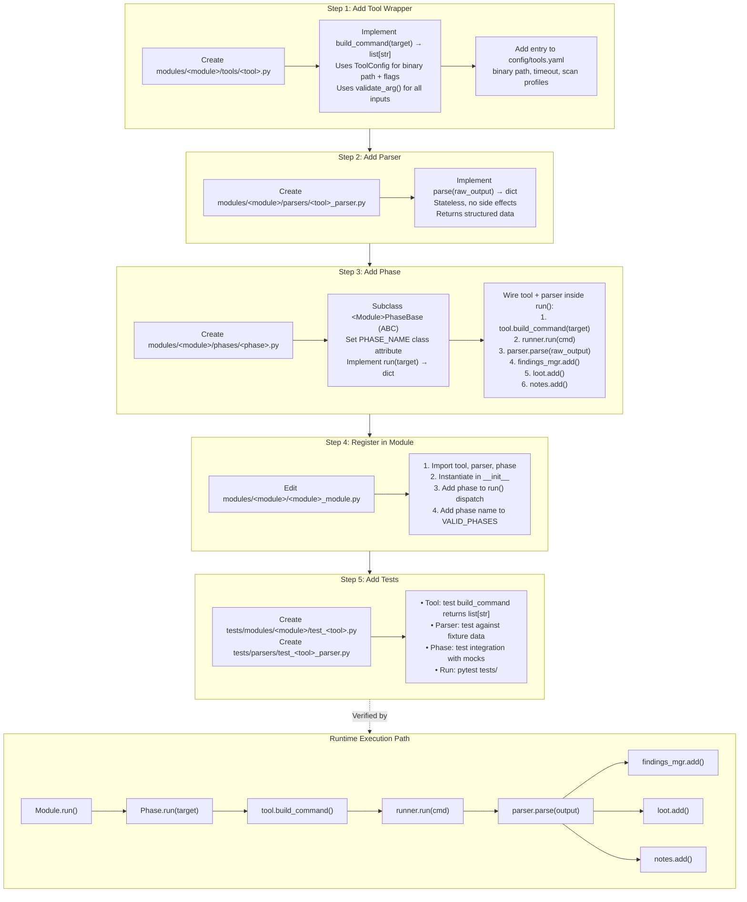

# Extending ReconForge

> Version 1.0 — Last updated: 2026-03-21

This guide walks through every extension point in ReconForge:
tool wrappers, parsers, phases, modules, configuration, and tests.
Every code example is derived from the actual codebase and uses the
current API.

**Cross-references:**

| Document | Purpose |
|----------|---------|
| [API_REFERENCE.md](API_REFERENCE.md) | Full class/method signatures |
| [ARCHITECTURE.md](ARCHITECTURE.md) | System overview and data flow |
| [DEVELOPMENT.md](DEVELOPMENT.md) | Coding standards and test conventions |
| [FINDINGS.md](FINDINGS.md) | 5-level confidence model and severity clamping |
| [CONFIGURATION.md](CONFIGURATION.md) | tools.yaml / profiles.yaml schema |

---

## 1. Introduction

### When to Extend vs. Configure

| Goal | Approach |
|------|----------|
| Change scan speed / timing | Edit `config/profiles.yaml` |
| Add a wordlist or tweak tool flags | Edit `config/tools.yaml` |
| Wrap a new external tool | Add a **tool wrapper** |
| Parse a new output format | Add a **parser** |
| Add a new reconnaissance step | Add a **phase** |
| Add an entirely new domain | Add a **module** (rare) |

### Extension Points Overview

The standard pipeline is:

```
tools/ → parsers/ → phases/ → <module>_module.py → core/
```

Every module follows this layout:

```
modules/<module>/
├── base.py              # Phase base class (ABC)
├── <module>_module.py   # Module orchestrator
├── tools/               # Tool wrappers (one per external binary)
├── parsers/             # Output parsers (stateless)
└── phases/              # Phases (orchestrate tools + parsers + findings)
```

### Extension Lifecycle Diagram



### Prerequisites

- Python 3.10+
- Familiarity with `core/runner.py` (subprocess execution) and
  `core/findings_manager.py` (finding creation)
- Read [DEVELOPMENT.md](DEVELOPMENT.md) for coding standards

### Key Rules (Non-Negotiable)

1. **All commands must be `list[str]`** — never `shell=True`, never string
   concatenation
2. **All user inputs must pass through `validate_arg()`** from `core/runner`
3. **Use `ToolConfig`** for configuration — no hardcoded overrides
4. **Use `FindingsManager.add()`** for findings — not convenience shortcuts
   in production phase code
5. **Use the structured exception hierarchy** from `core/exceptions`

---

## 2. Adding a Tool Wrapper

Tool wrappers live in `modules/<module>/tools/` and encapsulate a single
external binary.  They build `list[str]` commands, delegate execution to
`Runner`, and return `RunResult`.

### Step-by-Step

#### 2.1 Create the File

```
modules/network/tools/masscan.py
```

#### 2.2 Implement the Wrapper

Real pattern from `modules/web/tools/gobuster.py` and
`modules/network/tools/nmap.py`:

```python
"""ReconForge - Masscan Tool Wrapper."""

from __future__ import annotations

from pathlib import Path
from typing import List, Optional, TYPE_CHECKING

from core.runner import Runner, RunResult, validate_arg
from core.tool_config import ToolConfig

if TYPE_CHECKING:
    from core.config_loader import ConfigLoader


class MasscanTool:
    """Wrapper for masscan port scanner."""

    TOOL_NAME = "masscan"

    def __init__(
        self,
        runner: Runner,
        logger,
        output_dir: Path,
        opsec_mode: str = "normal",
        config: Optional["ConfigLoader"] = None,
    ):
        self.runner = runner
        self.logger = logger
        self.output_dir = Path(output_dir)
        self.opsec_mode = opsec_mode
        self.tool_cfg = ToolConfig(config, self.TOOL_NAME)

    def is_available(self) -> bool:
        """Check if masscan is installed."""
        return self.runner.check_tool(self.TOOL_NAME)

    def scan(self, target: str, ports: str = "1-65535",
             timeout: int = 600) -> RunResult:
        """Run a masscan port scan.

        Args:
            target: Target IP or CIDR (validated).
            ports: Port specification string.
            timeout: Execution timeout in seconds.

        Returns:
            RunResult with stdout/stderr and success flag.
        """
        target = validate_arg(target, "target")
        ports = validate_arg(ports, "ports")

        rate = {"stealth": "100", "normal": "1000", "aggressive": "10000"}.get(
            self.opsec_mode, "1000"
        )

        out_path = self.output_dir / "masscan_results.json"
        effective_timeout = self.tool_cfg.effective_timeout(
            self.opsec_mode, timeout
        )

        cmd: List[str] = [
            self.tool_cfg.binary or "masscan",
            target,
            "-p", ports,
            "--rate", rate,
            "-oJ", str(out_path),
        ]

        # Add mode-specific args from tools.yaml
        mode_args = self.tool_cfg.mode_args(self.opsec_mode)
        if mode_args:
            cmd.extend(mode_args.split())

        self.logger.info(f"Running masscan on {target} (rate={rate})")
        return self.runner.run(cmd, timeout=effective_timeout)
```

**Key points verified against actual code:**

- Constructor signature matches `GobusterTool`, `NmapTool`, etc.
  (`runner`, `logger`, `output_dir`, `opsec_mode`, `config`)
- `ToolConfig(config, self.TOOL_NAME)` — see `core/tool_config.py`
- `validate_arg()` — see `core/runner.py`
- `self.tool_cfg.effective_timeout()` — see `ToolConfig.effective_timeout()`
- `self.tool_cfg.binary` — falls back to empty string if no config
- `self.tool_cfg.mode_args()` — reads from `modes:` in tools.yaml
- Command is always `List[str]`
- Returns `RunResult` from `self.runner.run()`

#### 2.3 Error Handling

The `Runner` handles all subprocess errors internally and returns a
`RunResult` with `success=False`.  Tool wrappers should **not** catch
subprocess exceptions — let `Runner` handle them.

For cases where a missing tool should abort the phase, use:

```python
self.runner.check_tool_or_raise(self.TOOL_NAME)
```

This raises `ToolNotFoundError` (from `core/exceptions`).

For cases where a failed command should raise, use:

```python
result = self.runner.run_or_raise(cmd, timeout=effective_timeout)
```

This raises `ToolNotFoundError`, `TimeoutError`, or `ExecutionError`
depending on the failure mode.

#### 2.4 Integration with Runner

`Runner.run()` accepts `Union[str, Sequence[str]]`.  **Always pass
`list[str]`.**  String commands trigger a `DeprecationWarning` and are
split via `shlex.split`.

```python
# ✅ Correct — list[str]
cmd: List[str] = ["nmap", "-sS", "-p", "22,80", target]
result = self.runner.run(cmd, timeout=300)

# ❌ Wrong — string command (deprecated, unsafe)
result = self.runner.run(f"nmap -sS -p 22,80 {target}")
```

`RunResult` fields (from `core/runner.py`):

| Field | Type | Description |
|-------|------|-------------|
| `command` | `str` | Display string of the command |
| `returncode` | `int` | Process exit code (-1=timeout, -2=not found) |
| `stdout` | `str` | Captured stdout |
| `stderr` | `str` | Captured stderr |
| `duration` | `float` | Wall-clock seconds |
| `success` | `bool` | `True` when returncode == 0 |
| `output_file` | `Optional[str]` | Path if `output_file` was specified |

---

## 3. Adding a Parser

Parsers live in `modules/<module>/parsers/` and convert raw tool output
into structured Python objects.  They must be **stateless** — no side
effects, no findings creation, no logging.

### Parser Responsibilities

1. Accept raw `str` output (or a file path)
2. Return structured data (dataclasses or dicts)
3. Handle malformed/empty input gracefully — return empty structures,
   **never raise**

### Input/Output Contract

```python
class SomeParser:
    def parse(self, raw_output: str) -> <StructuredResult>: ...
    def parse_file(self, filepath: str) -> <StructuredResult>: ...  # optional
```

### Real Example

Pattern from `modules/network/parsers/nmap_parser.py`:

```python
"""ReconForge - Masscan Parser."""

import json
from dataclasses import dataclass, field
from typing import Any, Dict, List
from pathlib import Path


@dataclass
class MasscanPort:
    """A single port result from masscan."""
    port: int
    protocol: str = "tcp"
    service: str = ""


@dataclass
class MasscanHost:
    """A single host result from masscan."""
    ip: str
    ports: List[MasscanPort] = field(default_factory=list)

    @property
    def open_ports(self) -> List[int]:
        return [p.port for p in self.ports]


@dataclass
class MasscanResult:
    """Complete masscan scan result."""
    hosts: List[MasscanHost] = field(default_factory=list)

    @property
    def all_open_ports(self) -> List[int]:
        ports = set()
        for h in self.hosts:
            ports.update(h.open_ports)
        return sorted(ports)


class MasscanParser:
    """Parse masscan JSON output into structured data."""

    def parse(self, raw_output: str) -> MasscanResult:
        """Parse masscan JSON output.

        Args:
            raw_output: Raw JSON string from masscan -oJ.

        Returns:
            MasscanResult with parsed hosts and ports.
        """
        result = MasscanResult()

        try:
            data = json.loads(raw_output)
        except (json.JSONDecodeError, TypeError):
            return result

        hosts_map: Dict[str, MasscanHost] = {}
        for entry in data:
            ip = entry.get("ip", "")
            if not ip:
                continue
            if ip not in hosts_map:
                hosts_map[ip] = MasscanHost(ip=ip)
            for port_info in entry.get("ports", []):
                hosts_map[ip].ports.append(MasscanPort(
                    port=port_info.get("port", 0),
                    protocol=port_info.get("proto", "tcp"),
                    service=port_info.get("service", {}).get("name", ""),
                ))

        result.hosts = list(hosts_map.values())
        return result

    def parse_file(self, filepath: str) -> MasscanResult:
        """Parse masscan output from a file."""
        try:
            content = Path(filepath).read_text()
        except (FileNotFoundError, OSError):
            return MasscanResult()
        return self.parse(content)
```

**Pattern verified against:**

- `NmapParser` in `modules/network/parsers/nmap_parser.py` — uses
  dataclasses, `parse_xml()` / `parse_text()`, returns `NmapResult`
- All parsers return empty result objects on error, never raise

### Findings Generation

Parsers do **not** create findings.  The **phase** is responsible for
calling `FindingsManager.add()` after parsing.  This separation keeps
parsers testable in isolation.

---

## 4. Adding a Phase

Phases are the core orchestration units.  Each phase inherits from its
module's base class, receives 11 constructor parameters (the phase base
contract), runs tools, parses output, and records findings/loot/notes.

### 4.1 Phase Base Class Contract

All module base classes share an identical constructor signature
(11 parameters).  See `modules/network/base.py` or `modules/web/base.py`:

```python
class NetworkPhaseBase(ABC):
    PHASE_NUMBER: int = 0
    PHASE_NAME: str = "base"
    PHASE_DESCRIPTION: str = ""

    def __init__(
        self,
        logger: ReconLogger,           # 1. Logging instance
        runner: Runner,                 # 2. Subprocess executor
        config: ConfigLoader,           # 3. YAML config access
        output_dir: Path,              # 4. Parsed output directory
        findings: FindingsManager,      # 5. Finding tracker
        loot: LootManager,             # 6. Loot tracker
        workflow: AttackWorkflow,       # 7. Kill-chain tracker
        notes: NotesManager,            # 8. Session notes
        opsec: OpsecChecker,           # 9. OPSEC gating
        opsec_mode: str = "normal",    # 10. Current mode string
        profile: Optional[ProfileLoader] = None,  # 11. Resolved OPSEC profile
    ) -> None:
```

After `__init__`, these are available as instance attributes:

| Attribute | Type | Source |
|-----------|------|--------|
| `self.logger` | `ReconLogger` | `core/logger.py` |
| `self.runner` | `Runner` | `core/runner.py` |
| `self.config` | `ConfigLoader` | `core/config_loader.py` |
| `self.output_dir` | `Path` | Module's parsed directory |
| `self.findings` | `FindingsManager` | `core/findings_manager.py` |
| `self.loot` | `LootManager` | `core/loot_manager.py` |
| `self.workflow` | `AttackWorkflow` | `core/attack_workflow.py` |
| `self.notes` | `NotesManager` | `core/notes_manager.py` |
| `self.opsec` | `OpsecChecker` | `core/opsec_checks.py` |
| `self.opsec_mode` | `str` | `"stealth"`, `"normal"`, or `"aggressive"` |
| `self.profile` | `ProfileLoader` | `core/profile_loader.py` |
| `self.tools_used` | `List[str]` | Tracks which tools ran |

### 4.2 Required Methods

**`run()`** — the only abstract method.  Signature varies by module:

- Network phases: `run(self, target: str, **kwargs) -> Dict[str, Any]`
- Web phases: `run(self, target_url: str, **kwargs) -> Dict[str, Any]`

The return dict should include at least `finding_count` and `success`
keys.

**`execute()`** — template method defined on the base class.  It wraps
`run()` with lifecycle logging (phase start/end, workflow tracking,
error handling).  Module orchestrators call `execute()`, not `run()`
directly.

**`phase_output()`** — helper to get a `Path` inside the phase output
directory:

```python
out_path = self.phase_output("scan_results.json")
# Returns: self.output_dir / self.PHASE_NAME / "scan_results.json"
```

**`add_finding()`** — convenience wrapper that pre-fills `module` and
`phase`.  Calls `self.findings.add()` under the hood:

```python
self.add_finding(
    finding_type="vulnerability",
    severity="medium",
    confidence="high",
    target="10.10.10.1",
    description="SMB signing disabled",
    evidence="message_signing: disabled",
    recommendation="Enable SMB signing",
)
# Equivalent to:
self.findings.add(
    finding_type="vulnerability",
    severity="medium",
    confidence="high",
    target="10.10.10.1",
    module="network",       # auto-filled
    phase=self.PHASE_NAME,  # auto-filled
    description="SMB signing disabled",
    evidence="message_signing: disabled",
    recommendation="Enable SMB signing",
)
```

> **Note:** `add_finding()` is a convenience method on the base class.
> The canonical API is `self.findings.add()` (see
> [API_REFERENCE.md](API_REFERENCE.md) → FindingsManager).

### 4.3 Real Example — Phase Implementation

Pattern derived from `modules/network/phases/host_discovery.py`:

```python
"""ReconForge - Custom Reconnaissance Phase."""

from typing import Any, Dict

from modules.network.base import NetworkPhaseBase
from modules.network.tools.masscan import MasscanTool
from modules.network.parsers.masscan_parser import MasscanParser, MasscanResult


class MasscanDiscoveryPhase(NetworkPhaseBase):
    """Discover open ports via masscan."""

    PHASE_NUMBER = 5
    PHASE_NAME = "masscan_discovery"
    PHASE_DESCRIPTION = "Fast port discovery via masscan"

    def __init__(self, masscan: MasscanTool, parser: MasscanParser,
                 **kwargs) -> None:
        super().__init__(**kwargs)
        self.masscan = masscan
        self.parser = parser

    def run(self, target: str, **kwargs) -> Dict[str, Any]:
        """Execute masscan discovery.

        Args:
            target: Target IP or CIDR.

        Returns:
            Dict with discovered ports and finding count.
        """
        results: Dict[str, Any] = {
            "phase": self.PHASE_NAME,
            "target": target,
            "hosts": [],
            "finding_count": 0,
            "success": False,
        }

        # 1. OPSEC check
        if not self.opsec.check("masscan_scan"):
            self.logger.info(f"Skipping {self.PHASE_NAME} — OPSEC blocked")
            return results

        # 2. Tool availability
        if not self.masscan.is_available():
            self.logger.warning("masscan not found, skipping phase")
            return results

        self.tools_used.append("masscan")

        # 3. Record workflow hypothesis
        self.workflow.add_step(
            phase=self.PHASE_NAME,
            hypothesis=f"Fast port scan will reveal open services on {target}",
            command=f"masscan {target} -p1-65535",
            justification="masscan is faster than nmap for initial port discovery",
            alternatives=["nmap -sS -p- for more accurate results"],
        )

        # 4. Execute tool
        run_result = self.masscan.scan(target)

        if not run_result.success:
            self.logger.error(f"masscan failed: {run_result.stderr}")
            self.workflow.record_result(f"Failed: {run_result.stderr[:100]}")
            return results

        # 5. Parse output
        parsed: MasscanResult = self.parser.parse(run_result.stdout)

        # 6. Record findings
        for host in parsed.hosts:
            results["hosts"].append({
                "ip": host.ip,
                "ports": host.open_ports,
            })

            if host.open_ports:
                self.findings.add(
                    finding_type="exposure",
                    severity="info",
                    confidence="confirmed",
                    target=host.ip,
                    module="network",
                    phase=self.PHASE_NAME,
                    description=f"{len(host.open_ports)} open port(s) on {host.ip}",
                    evidence=f"Ports: {', '.join(str(p) for p in host.open_ports)}",
                )
                results["finding_count"] += 1

        # 7. Record loot
        for host in parsed.hosts:
            for port in host.ports:
                self.loot.add_service(
                    service=port.service or "unknown",
                    version="",
                    port=port.port,
                    source="masscan",
                    module="network",
                )

        # 8. Workflow result and next steps
        total_ports = sum(len(h.open_ports) for h in parsed.hosts)
        self.workflow.record_result(f"{total_ports} open ports found")

        for host in parsed.hosts[:5]:
            port_list = ",".join(str(p) for p in host.open_ports)
            self.workflow.suggest_next(
                command=f"nmap -sV -p {port_list} {host.ip}",
                justification=f"Version scan open ports on {host.ip}",
                priority="high",
            )

        results["success"] = True
        return results
```

**Key patterns verified against `HostDiscoveryPhase`:**

- `__init__` receives tool + parser instances, then `**kwargs` for the
  11 base class parameters
- `super().__init__(**kwargs)` passes all base class args
- OPSEC check via `self.opsec.check(technique_name)`
- Tool availability check via `tool.is_available()`
- `self.tools_used.append()` for tracking
- `self.workflow.add_step()` with `phase`, `hypothesis`, `command`,
  `justification`, `alternatives`
- `self.findings.add()` with all required fields including `module` and
  `phase`
- `self.loot.add_service()` for loot recording
- `self.workflow.record_result()` and `self.workflow.suggest_next()`
- Return dict with `finding_count` and `success`

---

## 5. Registering a Phase

### 5.1 Adding the Phase to the Module Orchestrator

Pattern from `modules/network/network_module.py`:

```python
# In the module __init__:

# 1. Import the phase
from modules.network.phases.masscan_discovery import MasscanDiscoveryPhase

# 2. Create shared phase kwargs dict (all 11 base class params)
self._phase_kwargs = dict(
    logger=self.logger,
    runner=self.runner,
    config=self.config,
    output_dir=self.parsed_dir,
    findings=self.findings_mgr,     # Module-level FindingsManager
    loot=self.loot,
    workflow=self.workflow,
    notes=self.notes,
    opsec=self.opsec,
    opsec_mode=opsec_mode,
    profile=self.profile,
)

# 3. Instantiate the phase with tool + parser + base kwargs
self.phase_masscan = MasscanDiscoveryPhase(
    masscan=self.masscan,
    parser=self.masscan_parser,
    **self._phase_kwargs,
)
```

> **Important:** At the module level, the `FindingsManager` instance is
> typically named `self.findings_mgr`.  It is passed to phases as the
> `findings` keyword argument and accessed inside phases as
> `self.findings`.

### 5.2 Calling the Phase in `run()`

```python
def run(self, phases=None, ...) -> Dict[str, Any]:
    # ...
    if "masscan_discovery" in phases_to_run:
        masscan_results = self.phase_masscan.run(
            target=self.target_str,
        )
        results["phases"]["masscan_discovery"] = masscan_results
```

Or, to use the full lifecycle template method:

```python
    masscan_results = self.phase_masscan.execute(
        target=self.target_str,
    )
```

`execute()` wraps `run()` with automatic phase start/end logging,
workflow tracking, and error handling (see `NetworkPhaseBase.execute()`).

### 5.3 Phase Ordering

Phases execute in the order they appear in the module's `run()` method.
By convention:

- `PHASE_NUMBER = 1` — Discovery / fingerprinting
- `PHASE_NUMBER = 2` — Enumeration / scanning
- `PHASE_NUMBER = 3` — Deep analysis / vulnerability scanning
- `PHASE_NUMBER = 4` — Exploitation candidates / authentication

Add `VALID_PHASES` entry so the CLI can select it:

```python
class NetworkModule:
    VALID_PHASES = ["discovery", "scanning", "enumeration",
                    "authentication", "masscan_discovery"]
```

### 5.4 Conditional Execution

Phases can be gated by OPSEC mode, profile settings, or prior results:

```python
# Profile-driven phase list
profile_phases = self.profile.enabled_phases()
phases_to_run = profile_phases if profile_phases else list(self.VALID_PHASES)

# OPSEC gating inside a phase
if not self.opsec.check("masscan_scan"):
    self.logger.info("masscan blocked by OPSEC policy")
    return results

# Conditional on prior phase results
if "scanning" in phases_to_run and live_hosts:
    scan_results = self.phase_scanning.run(targets=live_hosts)
```

---

## 6. Adding Tests

Tests live under `tests/` mirroring the source layout.

### 6.1 Test Structure

```
tests/
├── core/
│   ├── test_runner.py
│   ├── test_config_loader.py
│   └── ...
├── parsers/
│   ├── test_nmap_parser.py
│   ├── test_masscan_parser.py    # ← new
│   └── ...
└── modules/
    └── network/
        └── test_masscan_phase.py # ← new
```

### 6.2 Testing a Tool Wrapper

Pattern from `tests/core/test_runner.py`:

```python
"""Tests for MasscanTool wrapper."""

import pytest
from unittest.mock import MagicMock
from pathlib import Path

from modules.network.tools.masscan import MasscanTool
from core.runner import RunResult


class TestMasscanTool:
    """Test suite for MasscanTool."""

    def setup_method(self):
        """Set up test fixtures."""
        self.logger = MagicMock()
        self.runner = MagicMock()
        self.output_dir = Path("/tmp/test_output")

    def test_scan_builds_list_command(self):
        """Verify command is built as list[str], not a string."""
        self.runner.run.return_value = RunResult(
            command="masscan", returncode=0, stdout="",
            stderr="", duration=1.0, success=True,
        )
        tool = MasscanTool(self.runner, self.logger, self.output_dir)
        tool.scan("10.10.10.0/24")

        call_args = self.runner.run.call_args[0][0]
        assert isinstance(call_args, list)
        assert all(isinstance(a, str) for a in call_args)
        assert call_args[0] == "masscan"

    def test_scan_validates_target(self):
        """Verify shell metacharacters are rejected."""
        tool = MasscanTool(self.runner, self.logger, self.output_dir)
        with pytest.raises(ValueError, match="unsafe"):
            tool.scan("10.10.10.1; rm -rf /")

    def test_scan_includes_target_in_command(self):
        """Verify target appears in the command list."""
        self.runner.run.return_value = RunResult(
            command="masscan", returncode=0, stdout="",
            stderr="", duration=1.0, success=True,
        )
        tool = MasscanTool(self.runner, self.logger, self.output_dir)
        tool.scan("192.168.1.0/24")

        call_args = self.runner.run.call_args[0][0]
        assert "192.168.1.0/24" in call_args

    def test_is_available_delegates_to_runner(self):
        """Verify is_available() calls runner.check_tool()."""
        self.runner.check_tool.return_value = True
        tool = MasscanTool(self.runner, self.logger, self.output_dir)
        assert tool.is_available() is True
        self.runner.check_tool.assert_called_with("masscan")
```

### 6.3 Testing a Parser

Pattern from `tests/parsers/test_nmap_parser.py`:

```python
"""Tests for MasscanParser."""

import pytest

from modules.network.parsers.masscan_parser import (
    MasscanParser, MasscanResult, MasscanHost, MasscanPort,
)


@pytest.fixture
def parser():
    return MasscanParser()


class TestMasscanParser:
    """Test suite for MasscanParser."""

    def test_parse_valid_json(self, parser):
        """Parse well-formed masscan JSON output."""
        raw = '[{"ip": "10.10.10.1", "ports": [{"port": 80, "proto": "tcp"}]}]'
        result = parser.parse(raw)
        assert len(result.hosts) == 1
        assert result.hosts[0].ip == "10.10.10.1"
        assert 80 in result.hosts[0].open_ports

    def test_parse_empty_input(self, parser):
        """Empty input returns empty result, no exception."""
        result = parser.parse("")
        assert isinstance(result, MasscanResult)
        assert len(result.hosts) == 0

    def test_parse_malformed_json(self, parser):
        """Malformed JSON returns empty result, no exception."""
        result = parser.parse("{not valid json")
        assert len(result.hosts) == 0

    def test_parse_file_missing(self, parser):
        """Missing file returns empty result."""
        result = parser.parse_file("/nonexistent/path.json")
        assert len(result.hosts) == 0

    def test_all_open_ports_aggregation(self, parser):
        """Verify all_open_ports collects across all hosts."""
        raw = (
            '[{"ip": "10.10.10.1", "ports": [{"port": 22, "proto": "tcp"}]},'
            ' {"ip": "10.10.10.2", "ports": [{"port": 80, "proto": "tcp"}]}]'
        )
        result = parser.parse(raw)
        assert result.all_open_ports == [22, 80]
```

### 6.4 Testing a Phase

```python
"""Tests for MasscanDiscoveryPhase."""

import pytest
from unittest.mock import MagicMock
from pathlib import Path

from core.runner import RunResult
from modules.network.parsers.masscan_parser import MasscanResult, MasscanHost, MasscanPort


class TestMasscanDiscoveryPhase:
    """Test suite for MasscanDiscoveryPhase."""

    def setup_method(self):
        """Create mocked dependencies for all 11 base class params."""
        self.logger = MagicMock()
        self.runner = MagicMock()
        self.config = MagicMock()
        self.output_dir = Path("/tmp/test_parsed")
        self.findings = MagicMock()
        self.loot = MagicMock()
        self.workflow = MagicMock()
        self.notes = MagicMock()
        self.opsec = MagicMock()
        self.opsec.check.return_value = True  # Allow all techniques
        self.profile = MagicMock()

        self.masscan = MagicMock()
        self.masscan.is_available.return_value = True
        self.parser = MagicMock()

    def _make_phase(self):
        from modules.network.phases.masscan_discovery import MasscanDiscoveryPhase
        return MasscanDiscoveryPhase(
            masscan=self.masscan,
            parser=self.parser,
            logger=self.logger,
            runner=self.runner,
            config=self.config,
            output_dir=self.output_dir,
            findings=self.findings,
            loot=self.loot,
            workflow=self.workflow,
            notes=self.notes,
            opsec=self.opsec,
            opsec_mode="normal",
            profile=self.profile,
        )

    def test_run_records_findings(self):
        """Verify findings.add() is called for discovered ports."""
        self.masscan.scan.return_value = RunResult(
            command="masscan", returncode=0, stdout="[]",
            stderr="", duration=1.0, success=True,
        )
        host = MasscanHost(ip="10.10.10.1", ports=[MasscanPort(port=80)])
        self.parser.parse.return_value = MasscanResult(hosts=[host])

        phase = self._make_phase()
        result = phase.run(target="10.10.10.1")

        assert result["success"] is True
        assert result["finding_count"] == 1
        self.findings.add.assert_called()

    def test_opsec_blocked_skips_execution(self):
        """Phase returns empty results when OPSEC blocks the technique."""
        self.opsec.check.return_value = False

        phase = self._make_phase()
        result = phase.run(target="10.10.10.1")

        assert result["success"] is False
        self.masscan.scan.assert_not_called()

    def test_tool_unavailable_skips_execution(self):
        """Phase returns empty results when tool is not installed."""
        self.masscan.is_available.return_value = False

        phase = self._make_phase()
        result = phase.run(target="10.10.10.1")

        assert result["success"] is False
        self.masscan.scan.assert_not_called()
```

### 6.5 Running Tests

```bash
# All tests
python -m pytest tests/ -v

# Specific test file
python -m pytest tests/parsers/test_masscan_parser.py -v

# With coverage
python -m pytest tests/ --cov=core --cov=modules -v
```

---

## 7. Adding Config Entries

### 7.1 tools.yaml Structure

All tool configuration lives in `config/tools.yaml`.  This is the single
source of truth — no hardcoded overrides.

```yaml
tools:
  masscan:
    binary: masscan
    description: "Fast port scanner for large networks"
    required: false
    default_timeout: 600
    install_cmd: "sudo apt install -y masscan"
    detection: high
    modes:
      stealth:
        args: "--rate 100"
        timeout: 1200
        detection: medium
      normal:
        args: "--rate 1000"
        timeout: 600
        detection: high
      aggressive:
        args: "--rate 10000 --banners"
        timeout: 300
        detection: very_high
```

**Required fields:**

| Field | Type | Description |
|-------|------|-------------|
| `binary` | `str` | Executable name (looked up via `which`) |
| `description` | `str` | Human-readable description |
| `required` | `bool` | If `true`, module fails without this tool |
| `default_timeout` | `int` | Fallback timeout in seconds |

**Optional fields:**

| Field | Type | Description |
|-------|------|-------------|
| `install_cmd` | `str` | Installation command for documentation |
| `detection` | `str` | Base detection level (`low`/`medium`/`high`/`very_high`) |
| `opt_in_only` | `bool` | Requires explicit opt-in flag |
| `alt_binary` | `str` | Alternate binary name |
| `modes` / `scan_profiles` | `dict` | Per-mode configuration |
| `safety` | `dict` | Safety constraints (e.g., `max_tasks` for hydra) |
| `collection_methods` | `dict` | Collection methods (e.g., bloodhound) |

### 7.2 ToolConfig Usage

Tool wrappers access configuration through `ToolConfig`:

```python
from core.tool_config import ToolConfig

tc = ToolConfig(config, "masscan")

tc.binary              # "masscan"
tc.required            # False
tc.default_timeout     # 600
tc.detection           # "high"
tc.has_config          # True (non-empty YAML entry was loaded)

# Mode-specific access
tc.mode_timeout("stealth", default=600)    # 1200 (from YAML)
tc.mode_args("stealth")                    # "--rate 100"
tc.mode_detection("stealth")               # "medium"
tc.mode_requires_root("stealth")           # False

# Unified timeout resolution: mode → tool default → caller default
tc.effective_timeout("stealth", caller_default=300)  # 1200
tc.effective_timeout(None, caller_default=300)        # 600 (tool default)

# Backward compatibility: ToolConfig(None, "masscan") returns defaults
tc_none = ToolConfig(None, "masscan")
tc_none.binary          # "" (empty)
tc_none.has_config      # False
```

### 7.3 profiles.yaml Integration

Add entries to relevant profiles in `config/profiles.yaml` to control
phase/technique availability per OPSEC mode:

```yaml
profiles:
  stealth:
    scanning:
      masscan: false          # Disabled in stealth — too noisy
    allowed_noise_levels:
      - low

  normal:
    scanning:
      masscan: true
    allowed_noise_levels:
      - low
      - medium

  aggressive:
    scanning:
      masscan: true
    allowed_noise_levels:
      - low
      - medium
      - high
      - very_high
```

Access in phase code:

```python
# Check if technique is enabled in the profile
if self.profile and not self.profile.is_technique_enabled("masscan"):
    return results

# Or use OPSEC checker (reads from detection_map.py)
if not self.opsec.check("masscan_scan"):
    return results
```

---

## 8. Adding OPSEC / Detection Metadata

### 8.1 Detection Levels

Every tool and technique must have an entry in `core/detection_map.py`:

```python
# In core/detection_map.py

DETECTION_LEVELS = {
    # ...existing entries...
    "masscan_scan": {
        "noise": "high",
        "description": "Masscan high-rate port scanning",
    },
    "masscan_stealth": {
        "noise": "medium",
        "description": "Masscan low-rate port scanning",
    },
}
```

### 8.2 Noise Levels

| Level | Description | Allowed in |
|-------|-------------|------------|
| `low` | Passive or minimal traffic | stealth, normal, aggressive |
| `medium` | Moderate traffic, standard scans | normal, aggressive |
| `high` | Noisy traffic, likely triggers IDS | aggressive |
| `very_high` | Extremely noisy (brute-force, full scans) | aggressive |

### 8.3 OPSEC Mode Integration

`OpsecChecker` (from `core/opsec_checks.py`) gates technique execution:

```python
class OpsecChecker:
    def check(self, technique: str) -> bool:
        """Returns True if technique is allowed in current mode."""

    def warn(self, technique: str) -> Optional[str]:
        """Returns warning string if technique has high/very_high noise."""

    def set_mode(self, mode: str):
        """Change the active OPSEC mode."""
```

Usage inside a phase:

```python
# Gate execution
if not self.opsec.check("masscan_scan"):
    self.logger.info("masscan blocked by OPSEC policy")
    return results

# Optional warning for risky techniques
warning = self.opsec.warn("masscan_scan")
if warning:
    self.logger.warning(warning)
```

### 8.4 Profile Configuration

OPSEC modes are defined in `config/profiles.yaml` via
`allowed_noise_levels`:

- **stealth:** `[low]`
- **normal:** `[low, medium]`
- **aggressive:** `[low, medium, high, very_high]`

The `ProfileLoader` resolves module-specific profile variants
(e.g., `stealth_ad`, `normal_web`) before falling back to the base
profile.

---

## 9. Common Mistakes

### ❌ String Commands

```python
# WRONG — string concatenation, shell injection risk
cmd = f"nmap -sS -p 22,80 {target}"
result = self.runner.run(cmd)
```

```python
# ✅ CORRECT — list[str], safe
cmd: List[str] = ["nmap", "-sS", "-p", "22,80", target]
result = self.runner.run(cmd)
```

### ❌ Missing Input Validation

```python
# WRONG — target goes directly to subprocess
cmd: List[str] = ["nmap", "-sS", target]
```

```python
# ✅ CORRECT — validate before use
target = validate_arg(target, "target")
cmd: List[str] = ["nmap", "-sS", target]
```

### ❌ Incorrect Phase Constructor

```python
# WRONG — missing base class params, calling super with positional args
class MyPhase(NetworkPhaseBase):
    def __init__(self, runner, logger):
        self.runner = runner
        self.logger = logger
```

```python
# ✅ CORRECT — accept tool-specific args + **kwargs for base class
class MyPhase(NetworkPhaseBase):
    def __init__(self, my_tool: MyTool, **kwargs) -> None:
        super().__init__(**kwargs)
        self.my_tool = my_tool
```

### ❌ Using Obsolete API Names

```python
# WRONG — these do not exist in phases
self.findings_mgr.add(...)    # Module-level name, not available in phases
self.phase_output(...)        # Only valid inside a phase (not a module)
```

```python
# ✅ CORRECT — phase-level attribute names
self.findings.add(...)        # FindingsManager passed as 'findings' param
self.loot.add_credential(...) # LootManager passed as 'loot' param
```

### ❌ Hardcoded Values

```python
# WRONG — hardcoded timeout
result = self.runner.run(cmd, timeout=600)
```

```python
# ✅ CORRECT — timeout from ToolConfig hierarchy
effective_timeout = self.tool_cfg.effective_timeout(self.opsec_mode, 600)
result = self.runner.run(cmd, timeout=effective_timeout)
```

### ❌ shell=True

```python
# WRONG — never use shell=True
subprocess.run(f"nmap {target}", shell=True)
```

```python
# ✅ CORRECT — use Runner with list[str]
result = self.runner.run(["nmap", target])
```

### ❌ Missing Tests

Every new tool, parser, and phase needs tests covering:

- Command construction is `list[str]`
- Input validation rejects metacharacters
- Parser handles empty/malformed input
- Phase respects OPSEC blocking
- Phase records findings with correct severity/confidence

### ❌ Missing OPSEC Registration

```python
# WRONG — technique not in detection_map.py, opsec.check() always returns True
if not self.opsec.check("my_new_technique"):
    ...
```

Add the entry to `core/detection_map.py` **before** using it.

### ❌ Severity/Confidence Mismatch

```python
# WRONG — heuristic confidence cannot have critical severity
self.findings.add(
    finding_type="vulnerability",
    severity="critical",       # Will be CLAMPED to "low"
    confidence="heuristic",
    ...
)
```

Clamping rules (enforced by `FindingsManager`):

| Confidence | Maximum Severity |
|------------|-----------------|
| confirmed | critical |
| high | critical |
| medium | high |
| low | medium |
| heuristic | low |

See [FINDINGS.md](FINDINGS.md) for the full confidence model.

---

## Appendix: File Reference

| Extension Point | Location | Real Example |
|----------------|----------|--------------|
| Tool wrapper | `modules/<mod>/tools/` | `modules/network/tools/nmap.py`, `modules/web/tools/gobuster.py` |
| Parser | `modules/<mod>/parsers/` | `modules/network/parsers/nmap_parser.py` |
| Phase | `modules/<mod>/phases/` | `modules/network/phases/host_discovery.py` |
| Phase base class | `modules/<mod>/base.py` | `modules/network/base.py`, `modules/web/base.py` |
| Module orchestrator | `modules/<mod>/<mod>_module.py` | `modules/network/network_module.py` |
| Tool config | `config/tools.yaml` | nmap, gobuster, hydra entries |
| OPSEC profiles | `config/profiles.yaml` | stealth, normal, aggressive |
| Detection map | `core/detection_map.py` | All technique noise levels |
| Tests | `tests/` | `tests/core/test_runner.py`, `tests/parsers/test_nmap_parser.py` |

---

*Extension guide validated: 2026-03-21 — All patterns verified against codebase (348/348 tests passing)*
