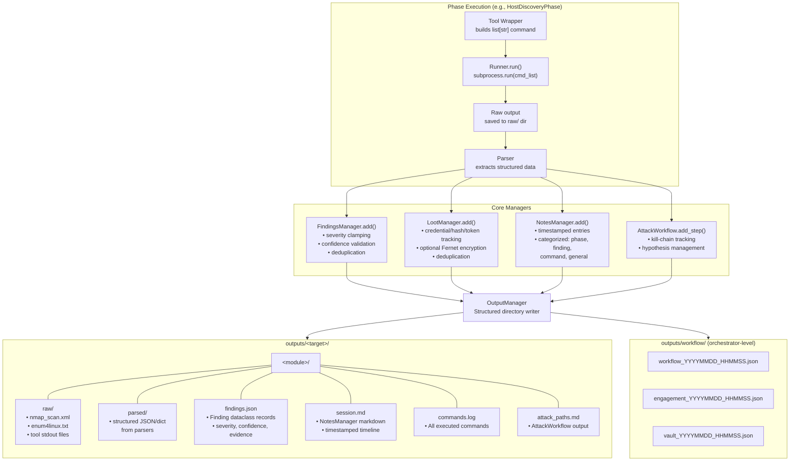

# ReconForge Findings & Confidence Model

> Version 1.1.0 — Last updated: 2026-04-13

## Overview

ReconForge implements a strict finding classification system designed to reduce false positives and prevent heuristic-only detections from being reported as high-severity issues. The system uses a **5-level confidence model** with **automatic severity clamping**.

## Confidence Levels

| Level | Rank | Description | Example |
|-------|------|-------------|---------|
| `confirmed` | 0 | Exploited or verified vulnerability | Successful SQL injection, authenticated access with default creds |
| `high` | 1 | Strong evidence of exploitability | Version match to known CVE with PoC |
| `medium` | 2 | Moderate evidence requiring further validation | Service banner suggests vulnerability, needs verification |
| `low` | 3 | Weak evidence requiring manual verification | Unusual response behavior, possible but unconfirmed |
| `heuristic` | 4 | Pattern-based detection with no concrete evidence | Parameter name suggests injection, URL pattern matches known vuln |

## Severity Levels

| Level | Rank | Icon | Description |
|-------|------|------|-------------|
| `critical` | 0 | 🔴 | Confirmed exploitable, high-impact vulnerability |
| `high` | 1 | 🟠 | Strong evidence of exploitability with significant impact |
| `medium` | 2 | 🟡 | Moderate evidence or moderate impact |
| `low` | 3 | 🔵 | Weak evidence or minimal impact |
| `info` | 4 | ⚪ | Informational, no direct security impact |

## Severity Clamping

When `FindingsManager` is in strict mode (default: `strict=True`), severity is automatically clamped based on confidence:

| Confidence | Maximum Severity | Rationale |
|------------|-----------------|-----------|
| `confirmed` | `critical` | No cap — verified findings |
| `high` | `critical` | No cap — strong evidence |
| `medium` | `high` | Medium confidence cannot claim critical |
| `low` | `medium` | Low confidence caps at medium |
| `heuristic` | `low` | **Heuristic findings are capped at low** |

### Clamping Rules

- **No high/critical severity** without at least `medium` confidence
- **Heuristic confidence** caps severity at `low`
- **Parameter names and URL patterns alone** do NOT constitute evidence
- **HTTP 500 alone** is classified as `heuristic/info` (not a vulnerability)

### Clamping Behavior

When severity is clamped, the finding description is annotated:

```
[severity clamped: high→low] Possible SQL injection in parameter 'id'
```

The `FindingsManager.clamped_count` property tracks how many findings had their severity reduced.

## Findings, Loot & Notes Data Flow



## Finding Structure

Each finding is a `Finding` dataclass:

```python
@dataclass
class Finding:
    id: str              # UUID-based short ID (8 chars)
    finding_type: str    # vulnerability, misconfiguration, exposure, credential,
                         # attack_vector, information, assessment, prioritisation
    severity: str        # critical, high, medium, low, info
    confidence: str      # confirmed, high, medium, low, heuristic
    target: str          # Target URL/host
    module: str          # Source module name
    phase: str           # Phase that generated the finding
    description: str     # Human-readable description
    evidence: str        # Supporting evidence string
    recommendation: str  # Remediation recommendation
    references: List[str]  # External reference URLs
    timestamp: str       # ISO 8601 timestamp
```

## Usage

### Adding Findings

```python
from core.findings_manager import FindingsManager

fm = FindingsManager(strict=True)  # strict mode is the default

# This finding will be accepted as-is (medium confidence allows up to high severity)
fm.add(
    finding_type="vulnerability",
    severity="high",
    confidence="medium",
    target="10.10.10.1",
    module="network",
    description="SMBv1 enabled on target",
    evidence="nmap script output shows SMBv1 negotiation",
    recommendation="Disable SMBv1",
    phase="service_enumeration",
)

# This finding will be clamped: heuristic confidence cannot have high severity
fm.add(
    finding_type="vulnerability",
    severity="high",
    confidence="heuristic",
    target="https://api.example.com",
    module="api",
    description="Possible IDOR in /users/{id} endpoint",
    evidence="Sequential IDs observed in URL pattern",
    recommendation="Implement authorization checks",
    phase="authorization",
)
# Result: severity clamped from "high" → "low"
```

### Querying Findings

```python
# Get all findings sorted by severity
all_findings = fm.get_all()

# Filter by severity
critical = fm.get_by_severity("critical")

# Filter by confidence
heuristic = fm.get_heuristic_findings()

# Filter by module
network_findings = fm.get_by_module("network")

# Counts
severity_counts = fm.count_by_severity()    # {"critical": 1, "high": 3, ...}
confidence_counts = fm.count_by_confidence()  # {"confirmed": 2, "heuristic": 5, ...}
clamped = fm.clamped_count                    # Number of severity-clamped findings
```

### Output Formats

```python
# JSON output
json_str = fm.to_json()
fm.save_json(Path("findings.json"))

# Markdown output (with severity icons and confidence breakdown)
md_str = fm.to_markdown()
fm.save_markdown(Path("findings.md"))
```

## Markdown Output Structure

The Markdown report includes:

1. **Summary** — total count, clamped count
2. **Severity Breakdown** — count per severity level
3. **Confidence Breakdown** — count per confidence level
4. **Detailed Findings** — each finding with icon, severity, description, evidence, recommendation, references

Example:

```markdown
# Security Findings

**Total:** 12 findings
**Severity Clamped:** 3 findings had severity reduced due to low confidence

- **CRITICAL:** 1
- **HIGH:** 3
- **MEDIUM:** 4
- **LOW:** 3
- **INFO:** 1

### Confidence Breakdown
- **confirmed:** 2
- **high:** 4
- **medium:** 3
- **low:** 1
- **heuristic:** 2

## 🔴 [CRITICAL] Default credentials on SSH service
- **ID:** a1b2c3d4
- **Type:** vulnerability
- **Target:** 10.10.10.1
- **Confidence:** confirmed
- **Module:** network / authentication_checks
- **Evidence:**
  hydra successfully authenticated with admin:admin
- **Recommendation:** Change default credentials immediately
```

## Module-Specific Confidence Conventions

### API Module
- **Authorization phase** uses `confidence="heuristic"` + `severity="low"` for pattern-based IDOR/authz detections
- **Fuzzing phase** classifies HTTP 500-only responses as `heuristic/info`
- **Authentication phase** uses `confidence="high"` or `confirmed` for JWT analysis results

### Surface Module
- Uses `ConfidenceScorer` for multi-signal scoring
- Score ≥ 0.80 → `confirmed`, ≥ 0.60 → `high`, ≥ 0.40 → `medium`, < 0.40 → `low`

### Network Module
- Anonymous access findings: `confidence="confirmed"` (directly verified)
- Version-based CVE matches: `confidence="high"` (version match, not exploit verified)

---

*Findings model validated: 2026-03-21 — 375/375 tests passing*
