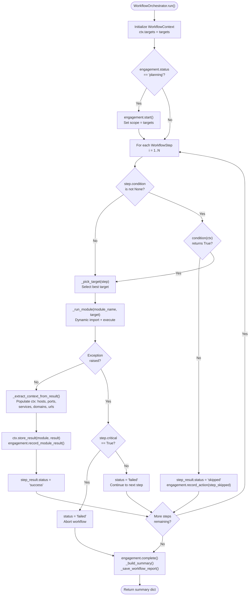
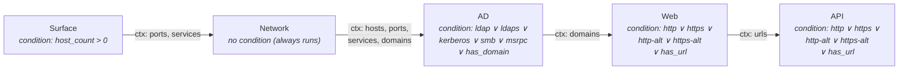

# ReconForge Workflow Orchestration Guide

**Author:** Andrews Ferreira

---

> **Canonical references:** See [USAGE.md](USAGE.md) for CLI flags,
> [CONFIGURATION.md](CONFIGURATION.md) for profile configuration,
> [MODULES.md](MODULES.md) for per-module phase details.


## Overview

The **Workflow Orchestrator** is the brain of ReconForge's cross-module
automation.  Instead of running modules one at a time, you define a
*pipeline* of steps—each mapped to a module—and the orchestrator:

1. Executes them in order.
2. Passes a shared **WorkflowContext** between steps (discovered hosts,
   ports, domains, URLs).
3. Evaluates **conditions** before each step so modules only run when
   their prerequisites are met (e.g., *AD recon* only fires when LDAP
   or Kerberos is detected).
4. Shares credentials across modules through the **CredentialVault**.
5. Optionally tracks the entire session through the **EngagementManager**.

---

## Quick Start

### Full Reconnaissance (all modules, conditional)

```bash
reconforge workflow --target 10.10.10.1 --opsec normal
```

This builds the default pipeline:

```
surface → network → ad (if LDAP/Kerberos found) → web (if HTTP found) → api (if HTTP found)
```

### Targeted Modules

```bash
reconforge workflow --target 10.10.10.1 \
    --modules network,web --opsec stealth
```

### With Engagement Tracking

```bash
reconforge workflow --target 10.10.10.1 \
    --engagement "Acme Assessment" --client "Acme Corp" --operator "alice"
```

---

## Workflow Orchestrator Flow Diagram



### Default Full-Recon Pipeline (`add_full_recon`)



## Core Concepts

### WorkflowContext

A shared data bus that flows through every step.

| Attribute       | Type                       | Description                         |
|-----------------|----------------------------|-------------------------------------|
| `targets`       | `List[str]`                | Original target list                |
| `live_hosts`    | `List[str]`                | Hosts confirmed alive               |
| `open_ports`    | `Dict[str, List[int]]`     | Per-host open ports                 |
| `services`      | `Dict[str, Set[str]]`      | Per-host service names              |
| `domains`       | `List[str]`                | Discovered AD/DNS domains           |
| `urls`          | `List[str]`                | Discovered web URLs                 |
| `module_results`| `Dict[str, Dict]`          | Raw result dicts from each module   |
| `extra`         | `Dict[str, Any]`           | Free-form storage for custom data   |

**Helper methods:**

```python
ctx.has_service("ldap")   # True if any host exposes LDAP
ctx.has_port(443)         # True if any host has 443 open
ctx.has_domain()          # True if AD domain was discovered
ctx.has_url()             # True if web URLs were found
ctx.host_count()          # Number of live hosts (or targets)
```

### CredentialVault

Centralised, deduplicated credential storage shared across all modules.

```python
from core.credential_vault import CredentialVault

vault = CredentialVault()
vault.add_password("admin", "P@ssw0rd", source="hydra", module="network")
vault.add_hash("aad3b435...", "NTLM", username="admin", module="ad")
vault.add_token("eyJhbG...", "jwt", source="burp", module="web")
vault.add_api_key("AKIA...", source="trufflehog", module="api")
vault.add_ssh_key("-----BEGIN RSA...", username="root")
vault.add_username("jsmith", source="ldap", module="ad")

# Query
vault.get_passwords()
vault.get_hashes()
vault.get_for_service("ssh")
vault.get_for_module("ad")
vault.get_usernames()

# Loot integration
vault.ingest_from_loot(loot_manager)   # auto-import from LootManager
vault.contribute_to_loot(loot_manager) # push vault creds into LootManager

# Persistence
vault.save(Path("vault.json"))
vault.load(Path("vault.json"))
vault.export_usernames(Path("users.txt"))
```

**Deduplication** is fingerprint-based: `type|username|secret|domain|service`.
Adding the same credential twice is silently ignored.

### EngagementManager

Lifecycle tracking for professional engagements.

```python
from core.engagement import EngagementManager

eng = EngagementManager(client="Acme Corp", operator="alice")
eng.start()                       # planning → active
eng.record_action("network", "port_scan", "TCP SYN top 1000")
eng.record_module_result("network", results)
eng.pause()                       # active → paused
eng.resume()                      # paused → active
eng.complete()                    # active → completed

eng.save(Path("engagement.json"))
eng2 = EngagementManager.load(Path("engagement.json"))
```

**Valid state transitions:**

```
planning → active → paused → active → completed
                  → cancelled
```

---

## Conditions

Conditions are callables `(WorkflowContext) → bool`.  Built-in
conditions:

| Condition           | Fires when …                              |
|---------------------|-------------------------------------------|
| `condition_ad`      | LDAP (389/636) or Kerberos (88) detected  |
| `condition_web`     | HTTP (80/443/8080/8443) detected          |
| `condition_api`     | HTTP detected (same as web)               |
| `condition_surface` | Always `True`                             |

### Custom Conditions

```python
from core.workflow_orchestrator import WorkflowOrchestrator

wo = WorkflowOrchestrator(targets=["10.10.10.1"])
wo.add_step("ad", condition=lambda ctx: ctx.has_service("ldap"))
wo.add_step("web", condition=lambda ctx: ctx.has_port(443))
wo.run()
```

---

## Programmatic Usage

### Minimal Pipeline

```python
from core.workflow_orchestrator import WorkflowOrchestrator

wf = WorkflowOrchestrator(targets=["10.10.10.1"])
wf.add_step("network")
wf.add_step("web", condition=lambda ctx: ctx.has_port(80))
wf.run()
```

### Full Recon (class method)

```python
wf = WorkflowOrchestrator.full_recon(
    ["10.10.10.1"],
    opsec_mode="stealth",
    verbose=True,
)
wf.run()
```

### Targeted (class method)

```python
wf = WorkflowOrchestrator.targeted(
    ["10.10.10.1"],
    modules=["network", "ad"],
    opsec_mode="normal",
)
wf.run()
```

### With Engagement

```python
from core.engagement import EngagementManager

eng = EngagementManager(client="Acme", operator="alice")
wf = WorkflowOrchestrator(
    targets=["10.10.10.1"],
    engagement=eng,
    opsec_mode="normal",
)
wf.add_full_recon()
wf.run()

eng.save(Path("outputs/engagement.json"))
```

---

## Architecture

```
┌────────────────────────────────────┐
│       WorkflowOrchestrator         │
│                                    │
│  ┌──────────┐  ┌───────────────┐   │
│  │  Context  │←→│  Cred Vault   │   │
│  └──────────┘  └───────────────┘   │
│       ↕                            │
│  ┌──────────────────────────────┐  │
│  │  Step 1: surface             │  │
│  │  Step 2: network             │  │
│  │  Step 3: ad (cond: LDAP)     │  │
│  │  Step 4: web (cond: HTTP)    │  │
│  │  Step 5: api (cond: HTTP)    │  │
│  └──────────────────────────────┘  │
│       ↕                            │
│  ┌──────────────────────────────┐  │
│  │  EngagementManager           │  │
│  └──────────────────────────────┘  │
└────────────────────────────────────┘
```

**Data flow per step:**

1. Evaluate condition against `WorkflowContext`.
2. If `True`, instantiate the module.
3. Inject `CredentialVault` into the module.
4. Run the module → collect results.
5. Extract context (hosts, ports, services, domains, URLs) from results.
6. Store results in `WorkflowContext.module_results`.
7. Ingest new credentials from module's `LootManager` into the vault.
8. Record action in `EngagementManager` (if enabled).

---

## Input Validation

The `core.validators` module provides reusable validation helpers:

```python
from core.validators import (
    validate_ip, validate_cidr, validate_hostname,
    validate_target, validate_port, validate_port_range,
    parse_port_list, validate_url, validate_domain,
)

validate_ip("10.0.0.1")           # "10.0.0.1"
validate_cidr("10.0.0.0/24")      # "10.0.0.0/24"
validate_port("443")              # 443
parse_port_list("22,80-82,443")   # [22, 80, 81, 82, 443]
validate_url("https://app.com")   # "https://app.com"
```

All validators raise `ValidationError` (from `core.exceptions`) on
invalid input.

---

## Custom Exceptions

All workflow-related errors inherit from `ReconForgeError`:

| Exception                | When raised                              |
|--------------------------|------------------------------------------|
| `WorkflowError`         | Pipeline misconfiguration or step failure |
| `CredentialVaultError`  | Vault encryption/decryption issues        |
| `EngagementError`       | Invalid lifecycle state transitions       |
| `ValidationError`       | Input validation failures                 |
| `ExecutionError`        | Tool execution failures                   |
| `ToolNotFoundError`     | Required external tool not installed      |
| `TimeoutError`          | Tool execution exceeds timeout            |

---

## CLI Reference

```
reconforge workflow [OPTIONS]

Options:
  --target TARGET       Target IP, hostname, or CIDR
  --modules MODULES     Comma-separated module list (default: full recon)
  --opsec MODE          OPSEC mode: stealth|normal|aggressive
  --engagement NAME     Engagement name for tracking
  --client NAME         Client name for engagement
  --operator NAME       Operator name for engagement
  --resume FILE         Resume from saved engagement JSON
  -v, --verbose         Verbose output
  --dry-run             Show commands without executing
  --timeout SECONDS     Per-tool timeout (default: 600)
  --encrypt-loot        Encrypt loot/vault files
  -o, --output DIR      Output base directory
```

---

*Generated by ReconForge v1.1.0 release — Andrews Ferreira*
